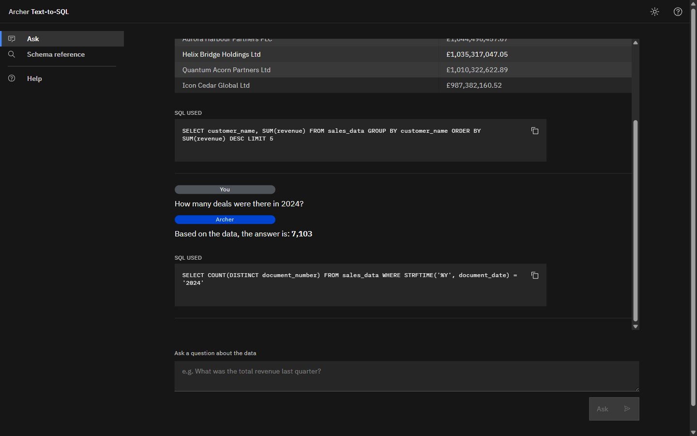

# Archer

Ask a sales database a question in plain English and get the answer, with the
SQL that produced it. Follow-up questions, explanations and several questions
in one message all work.

[](https://github.com/oliverjhj/archer/actions/workflows/ci.yml)
[](docs/evals.md)
[](backend/pyproject.toml)
[](LICENSE)

[Live demo](https://archer.2e8toyh6lcs9.eu-gb.codeengine.appdomain.cloud) - sign in with `demo` / `archer-demo-2026`

Built on IBM watsonx.ai, FastAPI and React, and deployed on IBM Code Engine.
The data is synthetic. The demo scales to zero when idle, so the first
question after a quiet spell can take a few seconds.



<details>
<summary>Watch a conversation (animated, about 25 seconds)</summary>


</details>

## What it does

```
"How many deals were there in 2024?"

  7,103
  SELECT COUNT(DISTINCT document_number) FROM sales_data
  WHERE STRFTIME('%Y', document_date) = '2024'
```

Every answer shows its SQL, so you can check how the figure was reached. On
this dataset, counting rows instead of distinct documents would have given
15,847.

A conversation carries on from there:

```
"Show me the top 5 customers by revenue"     a table, led by a one-line summary
"How many deals did the third one do?"       Interpreted as: How many deals did
                                             Helix Bridge Holdings Ltd do?  ->  321
"Can you explain that query?"                a plain-English walk through the SQL
"What about the second one?"  (no context)   a clarifying question, with options to click
```

## What it shows

- Accuracy is measured by a 61-case evaluation suite that runs the generated
  SQL and compares results with a reference query. It scores 98.4%, and the
  one failure is published. See [evals](docs/evals.md).
- Follow-ups are resolved from the conversation and shown as *Interpreted as*.
  Archer explains its own SQL, answers up to three questions per message, asks
  when a question can't be answered without guessing, and declines anything
  that isn't about the data.
- Prompts are versioned files, and every change is measured before and after.
- The database engine enforces the security: generated SQL runs on a read-only
  connection whose authorizer allows reading one table. See
  [security](docs/security.md).
- A daily message ceiling in the application caps the cost, because IBM Cloud
  spending limits only send notifications.
- 216 unit tests, four CI jobs, automatic deployment on every merge, a
  non-root multi-stage container, scale-to-zero hosting.

## How it works


The browser sends each question with the last three exchanges. A planner call
reads it in that context, decides whether it is a data question, conversation
about the data, or off-topic, and restates it so it stands on its own. Data
questions go to the SQL generator, and the query runs against a read-only
SQLite database. A failed query gets one corrected attempt, and rankings get a
one-line summary that is checked against the table before it is shown. Nothing
is stored on the server.

The dataset is generated at build time from a seeded script: 100,000 rows and
37 columns, identical for a given seed.

Full detail in [architecture](docs/architecture.md).

## Running it

Requires Python 3.12, Node 20, an IBM Cloud API key and a watsonx.ai project.

```bash
# Backend
python -m venv .venv
.venv/Scripts/python.exe -m pip install -e "backend[test]"
python scripts/generate_dataset.py          # builds sales.db
cp .env.example .env                        # then fill it in

# Frontend
npm --prefix frontend install
npm --prefix frontend run build

# Serve on http://localhost:8080
.venv/Scripts/python.exe -m uvicorn main:app --app-dir backend --port 8080
```

Or build the image, which does all of it:

```bash
docker build -f backend/Dockerfile -t archer .
```

To build your own version on your own data, see
[make your own](docs/make-your-own.md).

## Testing and evaluation

```bash
.venv/Scripts/python.exe -m pytest backend/tests/unit -m unit -q   # unit tests, offline
python evals/run_evals.py                                          # accuracy, real model calls
```

The evaluation suite needs live credentials and costs about 2p a run, so it is
run by hand before and after any prompt or model change rather than in CI.

## Documentation

| | |
|---|---|
| [Architecture](docs/architecture.md) | How a question becomes an answer |
| [Prompts](docs/prompts.md) | What each prompt does and why |
| [Evaluation](docs/evals.md) | How accuracy is measured, and the results |
| [Security](docs/security.md) | Threat model, controls and limitations |
| [Testing](docs/testing.md) | What the tests cover and what they can't |
| [CI and deployment](docs/ci.md) | What runs on every push, and how a merge goes live |
| [Infrastructure](infrastructure/README.md) | IBM Cloud resources, scaling and cost |
| [Make your own](docs/make-your-own.md) | Fork it and point it at your own data |
| [Contributing](CONTRIBUTING.md) | Rules for changes |

## Background

Archer began as a proof of concept at a UK IBM distributor, to show what
natural-language querying over sales data could look like. It was a demo, not
a system in daily use.

This repository rebuilds that idea as a public project on my own IBM Cloud
account, with synthetic data throughout. No employer data, code or
configuration is present.

## Licence

[Apache 2.0](LICENSE).
